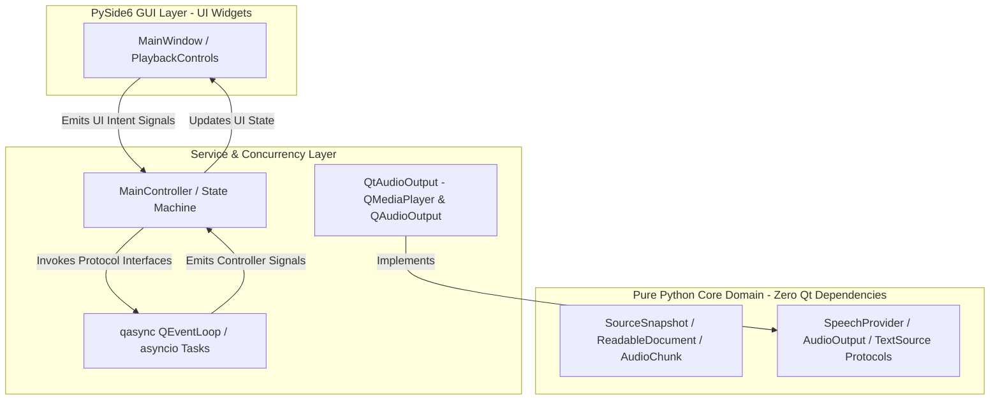

# Copy Cat — Architecture & Design Specification

## 1. High-Level Architecture Overview

Copy Cat follows a modular, decoupled architecture where text acquisition, document parsing, speech planning, TTS synthesis, audio playback, and UI presentation are cleanly separated via explicit interface protocols.

```text
+-----------------------+
|    Text Source        |  (Clipboard / Hotkey / UI Automation)
+-----------------------+
            |
            v
+-----------------------+
|    Source Snapshot    |  (Immutable raw text + metadata)
+-----------------------+
            |
            v
+-----------------------+
|    Document Parser    |  (markdown-it-py AST -> Document Blocks)
+-----------------------+
            |
            v
+-----------------------+
|   Auditory Document   |  (Structured blocks, outline, semantic IDs)
+-----------------------+
            |
            v
+-----------------------+
|    Reading Session    |  (Virtual cursor: block_idx, sentence_idx)
+-----------------------+
            |
            v
+-----------------------+
|    Speech Planner     |  (Normalization, policy enforcement, chunking)
+-----------------------+
            |
            v
+-----------------------+
|     TTS Provider      |  (edge-tts -> MP3 Audio Chunks)
+-----------------------+
            |
            v
+-----------------------+
|   Audio Output Queue  |  (In-Memory QBuffer -> PySide6 QtMultimedia)
+-----------------------+
            |
            v
+-----------------------+
|    PySide6 GUI / UI   |  (Highlighting, controls, progress, tray)
+-----------------------+
```

### Layered Architecture & Component Isolation


---

## 2. Core Domain Models

```python
from dataclasses import dataclass, field
from datetime import datetime
from enum import Enum
from typing import Protocol, Optional, List, Dict, Any

class BlockType(Enum):
    HEADING = "heading"
    PARAGRAPH = "paragraph"
    LIST = "list"
    LIST_ITEM = "list_item"
    CODE = "code"
    QUOTE = "quote"
    LINK = "link"
    TABLE = "table"
    METADATA = "metadata"
    BOILERPLATE = "boilerplate"

@dataclass(frozen=True)
class SourceSnapshot:
    raw_text: str
    source_application: Optional[str]
    captured_at: datetime
    source_id: str
    metadata: Dict[str, Any] = field(default_factory=dict)

@dataclass
class DocumentBlock:
    block_id: str
    block_type: BlockType
    text: str
    level: Optional[int] = None
    language: Optional[str] = None
    children: List["DocumentBlock"] = field(default_factory=list)
    source_start: Optional[int] = None
    source_end: Optional[int] = None

@dataclass
class ReadableDocument:
    document_id: str
    snapshot: SourceSnapshot
    title: Optional[str]
    blocks: List[DocumentBlock]
    outline: List[str]

@dataclass
class ReadingPosition:
    block_index: int = 0
    sentence_index: int = 0
    heading_path: List[str] = field(default_factory=list)

@dataclass
class ReadingPolicy:
    verbosity: str = "natural"          # "literal", "natural", "selective"
    code_mode: str = "announce_and_skip"# "announce_and_skip", "read_all", "omit"
    link_mode: str = "text_only"         # "text_only", "read_url", "omit"
    table_mode: str = "summary"         # "summary", "read_rows", "omit"
    announce_heading_levels: bool = False
    announce_list_positions: bool = False
    repeat_context_on_resume: bool = True

@dataclass
class ReadingSession:
    document: ReadableDocument
    position: ReadingPosition
    policy: ReadingPolicy
    voice: str = "en-US-JennyNeural"
    rate: str = "+0%"
    is_paused: bool = False
```

---

## 3. Provider Protocols & Interfaces

```python
class TextSource(Protocol):
    async def capture(self) -> SourceSnapshot: ...

class DocumentParser(Protocol):
    def parse(self, snapshot: SourceSnapshot) -> ReadableDocument: ...

@dataclass
class SpeechRequest:
    request_id: str
    text: str
    voice: str
    rate: str
    block_id: str

@dataclass
class AudioChunk:
    chunk_id: str
    request_id: str
    audio_bytes: bytes
    format: str  # "mp3", "wav"
    duration_ms: int
    block_id: str

class SpeechProvider(Protocol):
    async def synthesize(self, request: SpeechRequest) -> AudioChunk: ...

class AudioOutput(Protocol):
    def play(self, chunk: AudioChunk) -> None: ...
    def pause(self) -> None: ...
    def resume(self) -> None: ...
    def stop(self) -> None: ...
```

---

## 4. Playback State Machine

The session uses an explicit deterministic finite state machine (FSM).

```text
             +---------+
             |  IDLE   |
             +---------+
                  |
             (Read clicked)
                  v
           +---------------+
           |   CAPTURING   |
           +---------------+
                  |
           (Captured text)
                  v
            +-------------+
            |   PARSING   |
            +-------------+
                  |
           (Parsed document)
                  v
           +---------------+
           |   BUFFERING   |
           +---------------+
                  |
           (First audio chunk ready)
                  v
            +-------------+    Pause    +------------+
            |   PLAYING   | <---------> |   PAUSED   |
            +-------------+   Resume    +------------+
                  |
           (Finished or Stop)
                  v
            +-------------+
            |  STOPPING   |
            +-------------+
                  |
                  v
             +---------+
             |  IDLE   |
             +---------+
```

### Error States
- `CAPTURE_FAILED`: Empty text input, whitespace-only, or missing accessibility selection.
- `PARSE_FAILED`: Document parsing exception.
- `SYNTHESIS_FAILED`: Network error, Edge TTS timeout, or Bing endpoint rate limit.
- `AUDIO_OUTPUT_FAILED`: QtMultimedia player error or missing sound device.

---

## 5. Audio Output & In-Memory `QBuffer` Strategy

To eliminate Windows temporary file locking bugs (`WinError 32: PermissionError`) and disk cleanup leaks:
- **In-Memory Streaming**: Synthesized MP3 bytes are converted to `PySide6.QtCore.QByteArray` and wrapped in `PySide6.QtCore.QBuffer` opened in `QIODevice.ReadOnly`.
- **Reference Pinning**: `QtAudioOutput` retains strong Python instance references to active `(QByteArray, QBuffer)` pairs during playback to prevent premature garbage collection native access violations.
- **Request Generation Guards**: Every synthesis request carries a unique `request_id`. When Stop or Skip is invoked, active request IDs are invalidated, preventing stale network callbacks from accidentally triggering playback after a user cancels.
